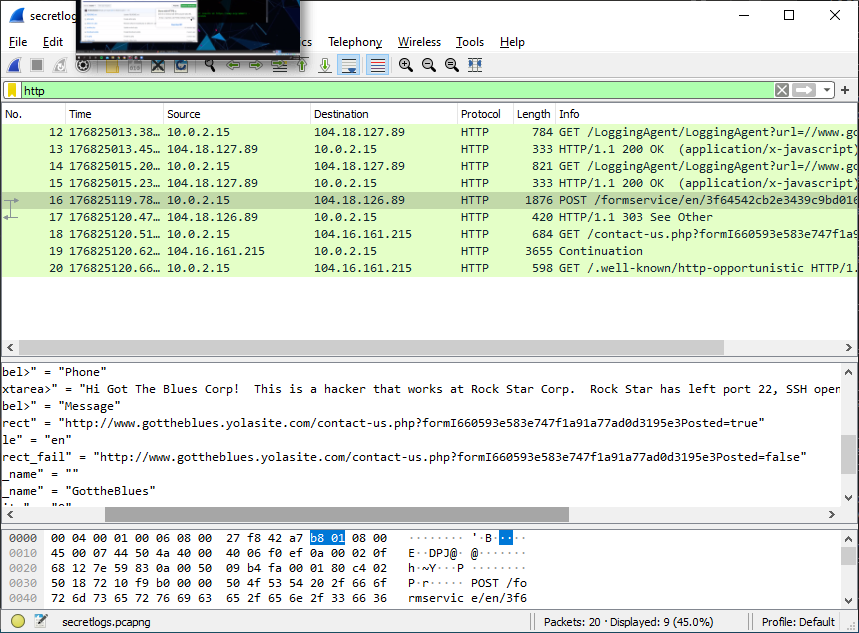

# Scripts_and_Diagrams
# the scripts and diagrams from my months in CyberBootcamp
##In this repository I have some of my better work to show
##but most of the things that I will talk about will be images of my work.
##my notes are available at Scripts_and_Diagrams/Notes

The first few weeks of my training at the cybersecurity Bootcamp consisted of 
reviewing basic Linux commands and getting used to reading and obtaining useful 
information from different sources such as Google and the Symantec articles 
we were assigned to read. This gave us a nice start and introduction to the world 
of infosec. While showing us what was to come.

Week three we were moving on to the novice level Linux commands like "awk" and "sed".
we dipped our feet in and got a taste of what Linux was. By the end of the week
I had been able to make a small shell script. The assignment was an investigation
at the "LuckyDuck" Casino. The data provided were of the dealers working during 
the week of a HUGE loss in money for the casino. The people playing on those nights
and the amount of currency lost was also provided. My job was to create a script
that would help the LuckyDuck employees sort through the people working on 
those nights to see if there was any correlation between the dealers and the 
players. 

#The script shown above is the one I wrote to sort the Roulette table Dealers by 
#time, AM or PM and also by name
##Run ./roulette_dealer_finder_by_time.sh <00:00:00> <am/pm> <Name>

The weeks that followed help harden our understanding of Linux systems.
we learned the fundamentals of Linux Administrating, and how to archive 
and log data within the linux terminals using "tar". how to copy, zip, store, and
unzip files. we also learned how to program a "cron" job, to automate the system
to back itself up.

We did a "scavenger hunt" at the end of week six, the last week of Linux for a bit, 
the scavenger hunt was a CTF situation, we had to use what we learned to 
find six flags that were encrypted and held a message for those that collected 
all six. Teaching us different techniques to escalate privileges and access and
extract data.

#we used john the ripper during and at the end of the scavenger hunt to Bruteforce
#the passwords and flags to get results.

After Linux we moved onto windows and learned most of the in and outs of one of
the most popular OS in the world. a bit of PowerShell and scripting on there 
and windows CMD. what we focused on was creating and administrating windows
machines on a windows server. creating accounts and groups, as well as 
Group Policy Objects, otherwise known as GPO's, containing password lockout settings
and share files for my Development groups.

#the dev share folder and the Lockout GPO

The following weeks, weeks eight and nine, we're all about networking and understanding
how networks work. week eight had us learn the OSI model along with learning 
the basics of traversing a network with tools like "nslookup", "fping", 
and "Wireshark". we analyzed PCAP files, Http requests and responses headers, 
and the Ports&Protocols that data uses to traverse the internet.

Week nine hardened our understanding of networking and had us do another CTF at
the end of the week. we had to also had to figure out why a mail server couldn't 
receive the emails, then fix another server and attempt to prevent them from 
receiving another Dos attack and figure out how it happened in the first place.

#this is a pcap of me finding the message the hacker left on the Blues Corp

Week ten was where we learned about cryptography and the importance of encryption and
hashes, learning different types of encryption and how to encrypt and decrypt messages
with public and private keys. we also briefly went over binary and tools like Openssl, 
Hashcat , and Steghide.

#the Screenshot above is one of me using Openssl to decrypt an encrypted word
#that was a key to the end of the Homework assignment, I am personally proud 
#of the script I used to decypt it because the version of openssl that was used 
#to encrypt the key was older than the one I used to decrypt it. so I had to 
#find the solution and write my own to decrypt it and get the right answer. 

Week Eleven we learned about networ  security. Learning about the Cyber Kill Chain,
how to read Snort Rules and Snort headers, to help us determine the intention of 
someone that set off an alert; and how to use and setup Firewalld.

 
#Me using Firewalld to set up services and interfaces on my zones

The last Two weeks as of 07/20/2020 were about creating and managing a Cloud network
using portal.azure to do so. Week 12 saw us create our RedTeam network with a 
load balancer, jump box, and three web Virtual Machines that held the Docker 
containers that we used, and the tool we used to configure all of our containers,
Ansible. we wrote YAML playbooks and configured them to our webservers under the 
ansible/hosts file.

Week 13 built onto our network with our Elk stack Project

the project helped us learn about ELK and what it does.
we linked the Elk server to our cloud network to monitor the webservers for 
suspicious activity. We used filebeat and metricbeat to do so.

cbeat_yml](./Scripts/YAML_files/metricbeat_playbook.yml)

#all of the important ansible configuration files

##the Diagrams of the network

#cloud network

#Elk server added to network
